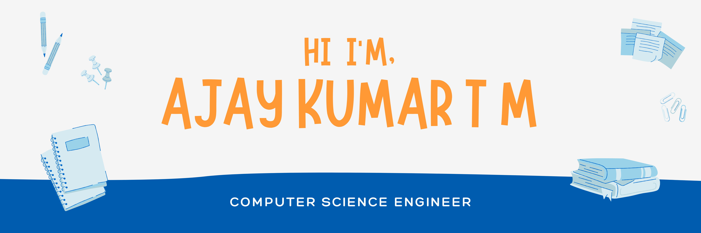

<h2>👋 To Whom It May Concern,</h2>
- I am currently pursuing my Bachelors Degree in Computer Science 👨‍💻.  
- I came across the concept of Software Development and <a href="https://github.com/Ajaiqmar/LEETCODE">Competitive Programming</a> during my first year in college, since then,it has been a joyride.  
- Something about turning our creative ideas into a working software model seems to fascinate me a lot. When it comes to competitive programming, it is like solving a word problem which we used to do in our childhood except here the problem at hand can be solved in numerous ways. So, I think that by doing competitive programming has enriched my creative and critical thinking.  
- I am disclosing my <a href="https://drive.google.com/file/d/1t5JzSkhpUdiuixRqhFYw6yw4SjR7TLg1/view?usp=sharing">Resume</a> here to whom it may concern.
  
<h2>☎ Contacts</h2>
 

